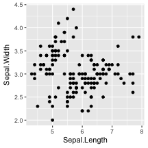
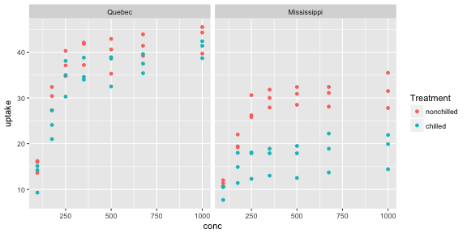
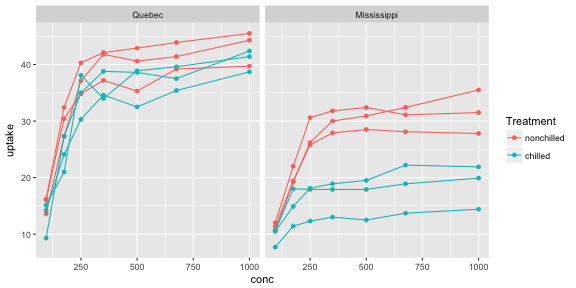
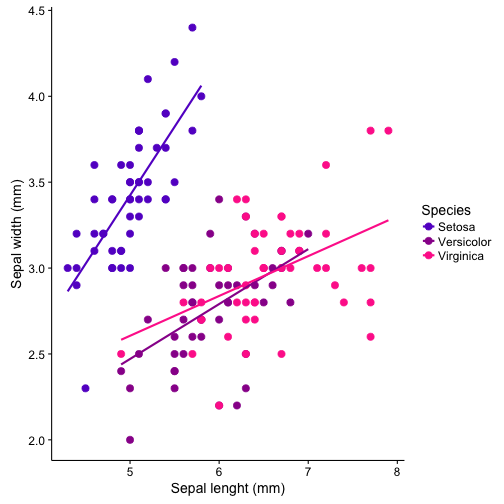
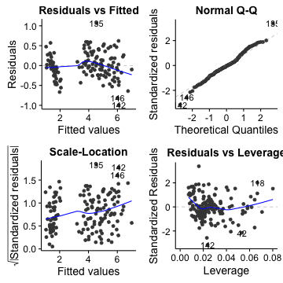

ggplot2
========================================================
author: Malie Lessard-Therrien and Etienne Low-Décarie 
date: May 8, 2017
width: 1024
height: 768


What is a graph?
===

- Statistics and design combined
- Explore and explain
- Communicating results


ggplot2
===

Beautiful and flexible


Outline (ggplot2)
===

Day I

Your first ggplot plot
- Basic scatter plot 
- Exercise 1

Grammar of graphics
- More advanced plots
- Aesthetics, Geometrics
- Exercise 2

Facets
- Exercise 3

Saving your graphs

***    

Day II

Pretty graphs for presentation
- Fine tunning
- Package cowplot
- Exercise 4

Maps
    


Install/load ggplot2
===


```r
if(!require(ggplot2)){install.packages("ggplot2")}
require(ggplot2)
```


Iris dataset
===

- Edgar Anderson
- RA Fischer


```r
head (iris)
```

```
  Sepal.Length Sepal.Width Petal.Length Petal.Width Species
1          5.1         3.5          1.4         0.2  setosa
2          4.9         3.0          1.4         0.2  setosa
3          4.7         3.2          1.3         0.2  setosa
4          4.6         3.1          1.5         0.2  setosa
5          5.0         3.6          1.4         0.2  setosa
6          5.4         3.9          1.7         0.4  setosa
```


What to use when
===

Explore your data using function "qplot"
- For you and your colleagues
- Quick
- Default settings can't be changed
- like the function "plot" in R-base


Explain a pattern (or lack of) in your data using function "ggplot"
- For presentation or publication
- All settings must be specified
- Flexible (you have the control over all settings)


Your first graph with ggplot2 
===

A basic scatter plot

```r
qplot(data=iris,
      x=Sepal.Length,
      y=Sepal.Width)
```

***




Change axis names 
===


```r
qplot(data=iris,
      x=Sepal.Length,
      y=Sepal.Width,
      xlab="Sepal length (mm)",
      ylab="Sepal width (mm)")
```


Exercice 1
===
produce a basic plot with built in data

```
data()
CO2
?CO2

```
WARNING: THERE ARE MULTIPLE CO2/co2 datasets
(CASE SENSITIVE, use capitals)

<div class="centered">

<script src="countdown.js" type="text/javascript"></script>
<script type="application/javascript">
var myCountdown2 = new Countdown({
    							time: 600, 
									width:150, 
									height:80, 
									rangeHi:"minute"	// <- no comma on last item!
									});

</script>

</div>


Grammar of graphics (gg)
===

2 principles:
- distinc layers of graphical elements
- meaningful plots using aesthetic mapping

***


Graph elements
===

3 essentials:
- Data (what you collected, in the right format)
- Aesthetics (aes)
- Geometries (geom)


4 optionals:
- Facets
- Coordinates
- Themes
- Statistics


***


Aesthetics
===

set with the aes() function
- color ("outside" color)
- fill ("inside" color)
- shape (of points)
- linetype
- size (of points or line)
- position (i.e., on the x and y axes)
- group (that a point belongs to)
- alpha (transparency of the point)


Geometic Objects 
===

set with the "geom_..." command

Ex:
- points (geom_point, for scatter plots, dot plots, etc)
- lines (geom_line, for time series, trend lines, etc)
- boxplot (geom_boxplot, for, well, boxplots!)
- violins (geom_violin, region inside the violin contains all of the observed data)

A plot must have at least one geom; there is no upper limit. You can add a geom to a plot using the + operator


Available elements
===

http://ggplot2.tidyverse.org/reference/

<iframe src="http://ggplot2.tidyverse.org/reference/" width="1000" height="800">
  <p>Your browser does not support iframes.</p>
</iframe>


How it works
===

- 1. create a simple plot object

```r
plot.object<-qplot() # to explore 
or
plot.object<-ggplot() # to explain 
```
- 2. add graphical layers/complexity

```r
plot.object<-plot.object+layer()
```
- 3. repeat step 2 until satisfied  
- 4. print your object to screen (or to graphical device)  

```r
print(plot.object)
```


Scatter plot as an R object with qplot
===


```r
basic_graph<-qplot(data=iris,
                  x=Sepal.Length,
                  y=Sepal.Width,
                  xlab="Sepal length (mm)",
                  ylab="Sepal width (mm)")

print(basic_graph)
```


Scatter plot as an R object with ggplot
===

Note: aes() and geom_point()


```r
basic_graph <- ggplot(data=iris,
                    aes(x=Sepal.Length,
                        y=Sepal.Width))+
                      xlab("Sepal length (mm)")+
                      ylab("Sepal width (mm)")+
                      geom_point()
                    
print (basic_graph)
```


Geometric example
===
Scatter plot with colour and shape


```r
basic_graph <- basic_graph+
              aes(colour=Species,
                  shape=Species)

print(basic_graph)
```


Geometric example
===
Scatter plot with linear regression

Add a geom (eg. linear smooth)


```r
basic_graph_lm <- basic_graph+
  geom_smooth(method="lm", se=F)

print(basic_graph_lm)
```


Exercise 2
===

Produce a colorful plot containing linear regressions with built in data

```
CO2
?CO2
data()
```
WARNING: THERE ARE MULTIPLE CO2/co2 datasets
(CASE SENSITIVE, use capitals)

<div class="centered">

<script src="countdown.js" type="text/javascript"></script>
<script type="application/javascript">
var myCountdown2 = new Countdown({
    							time: 600, 
									width:150, 
									height:80, 
									rangeHi:"minute"	// <- no comma on last item!
									});

</script>

</div>


Geometric example  
===

Categorical x-axis


```r
basic_graph_cat <- ggplot(data=iris,
                          aes(x=Species,
                              y=Sepal.Width))+
                              xlab("Species")+
                              ylab("Sepal width (mm)")+
  geom_point()
  
print (basic_graph_cat)
```
.  
.  
.  

```r
basic_graph_cat_bx <- basic_graph_cat+
  geom_boxplot ()

print (basic_graph_cat_bx)
```
***


Geometric example  
===

Categorical x-axis, geom_violin


Facets
===

Divide the data graphically

facet_grid(rows~columns)


```r
iris_facets <- basic_graph + 
              facet_grid(. ~ Species)

print (iris_facets)
```
***


Exercise 3
===

Create a colorful graph with the data you have used using geoms and facets


```
CO2
?CO2
data()
```
<div class="centered">

<script src="countdown.js" type="text/javascript"></script>
<script type="application/javascript">
var myCountdown3 = new Countdown({
    							time: 600, 
									width:150, 
									height:80, 
									rangeHi:"minute"	// <- no comma on last item!
									});

</script>

</div>


Facets
===

Using CO2 data

```r
head (CO2)
```

```
  Plant   Type  Treatment conc uptake
1   Qn1 Quebec nonchilled   95   16.0
2   Qn1 Quebec nonchilled  175   30.4
3   Qn1 Quebec nonchilled  250   34.8
4   Qn1 Quebec nonchilled  350   37.2
5   Qn1 Quebec nonchilled  500   35.3
6   Qn1 Quebec nonchilled  675   39.2
```

Facets
===


```r
CO2_graph_facets<-ggplot(data=CO2,
                aes(x=conc,
                    y=uptake,
                    colour=Treatment))+
  geom_point()+
  facet_grid(.~Type)
  
print(CO2_graph_facets)
```



Groups
===

Problems when adding the geom_line


```r
print(CO2_graph_facets+geom_line())
```


Groups
===

Solution: specify groups


```r
CO2_graph_fg<-CO2_graph_facets+geom_line(aes(group=Plant))

print(CO2_graph_fg)
```



Help
===

- R-help
- R Cookbook (ex facets: http://www.cookbook-r.com/Graphs/Facets_(ggplot2)/
- Cheatsheets (see https://www.rstudio.com/wp-content/uploads/2015/03/ggplot2-cheatsheet.pdf)
- Stackoverflow (google your question with ggplot2)

Saving plots
===


```r
pdf("./Plots/todays_plots.pdf")
  print(basic_graph)
  print(basic_graph_lm)
  print(basic_graph_cat_bx)
  print(iris_facets)
  print(CO2_graph_facets)
graphics.off()
```

all other R-base save functions available:  
`bmp()`, `jpeg()`, etc

Saving plots
===

ggsave: saves last plot and guesses format from file name


```r
ggsave("./Plots/todays_plots.jpeg", iris_facets)
```

Day 2
===

Pretty and meaningful graphs
- Fine tunning (color, coordinates, themes)
- Exercise 4
- Package cowplot, fortify
- Exercise 5


Maps


Fine tunning
===
Give new color to each iris species

Step 1: Create the reference graph


```r
iris_color_graph <- ggplot (data=iris, 
                            aes (x= Sepal.Length,
                                 y=Sepal.Width, 
                                 color=Species))+
  xlab("Sepal lenght (mm)")+
  ylab("Sepal width (mm)")+
  geom_point(size = 3)+
  geom_smooth(method="lm", se=F)

print (iris_color_graph)
```


Fine tunning
===
Give new color to each iris species

Step 2: Change color manually, using base color


```r
iris_color_graph_manual <- iris_color_graph +
  scale_color_manual(values=c("setosa"="red",
                              "versicolor"="pink",
                              "virginica"="purple"), 
                     labels=c("Setosa",
                              "Versicolor", 
                              "Virginica"))

print (iris_color_graph_manual)
```


Fine tunning
===
Give new color to each iris species

Step 2: Change color manually, using hexadecimal codes


```r
iris_color_graph_manual_hexa <- iris_color_graph +
  scale_color_manual(values=c("setosa"="#6600CC",
                              "versicolor"="#990099",
                              "virginica"="#FF3399"), 
                     labels=c("Setosa",
                              "Versicolor", 
                              "Virginica"))

print (iris_color_graph_manual_hexa)
```


Color options
===

http://www.cookbook-r.com/Graphs/Colors_(ggplot2)/

<iframe src="http://www.cookbook-r.com/Graphs/Colors_(ggplot2)/" width="1000" height="800">
  <p>Your browser does not support iframes.</p>
</iframe>

Exercise 4
===

Change the shape of data points manually with the dataset you have used
and/or your own data

see: http://www.cookbook-r.com/Graphs/Shapes_and_line_types/

```
CO2
?CO2
data()
```

<div class="centered">

<script src="countdown.js" type="text/javascript"></script>
<script type="application/javascript">
var myCountdown3 = new Countdown({
    							time: 600, 
									width:150, 
									height:80, 
									rangeHi:"minute"	// <- no comma on last item!
									});

</script>

</div>


Coordinates
===


```r
DF <- data.frame(variable = LETTERS[1:10], value = sample(10, replace = TRUE))

bar_graph <- ggplot(data=DF, 
                aes(x=variable,
                fill=variable,
                y=value))+
                geom_bar(stat="identity")

print(bar_graph)
```


Coordinates
===

Change looks of graph by changing coordinates

```r
polar_graph <- bar_graph +
  coord_polar()

print(polar_graph)
```


Themes
===

Change font size

```r
iris_classic_fs <- iris_color_graph_manual_hexa +
  theme(axis.title.x=element_text(size=30),
        axis.text.x=element_text(size=25))+
  theme(axis.title.y=element_text(size=30),
        axis.text.y=element_text(size=25))
print (iris_classic_fs)
```


Themes
===

Set B&W using theme_classic ()

```r
iris_classic <- iris_color_graph_manual_hexa+
           theme_classic(base_size = 20)

print (iris_classic)
```
***


Graph with cowplot
===

- simple add-on to ggplot2
- provide a publication-ready theme for ggplot2
- minimum amount of fiddling with sizes of axis labels, plot backgrounds, etc

see https://cran.r-project.org/web/packages/cowplot/vignettes/introduction.html


```r
if(!require(cowplot)){install.packages("cowplot")}
require(cowplot)
```


Cowplot, B&W graph 
===

With cowplot, your graph background is B&W by default


```r
iris_cowplot <- iris_color_graph_manual_hexa

print (iris_cowplot)
```
***


Exercise 5
===

1. Create a B&W background graph with the dataset you have used
and/or your own data

2. Change the font of the axis titles, see http://www.cookbook-r.com/Graphs/Fonts/


```
CO2
?CO2
data()
```

<div class="centered">

<script src="countdown.js" type="text/javascript"></script>
<script type="application/javascript">
var myCountdown3 = new Countdown({
    							time: 600, 
									width:150, 
									height:80, 
									rangeHi:"minute"	// <- no comma on last item!
									});

</script>

</div>


Cowplot, multiple graphs
===

Label and align multiple graphs


```r
fig.1 <- plot_grid(iris_color_graph_manual, iris_cowplot,
                   labels = c("a)", "b)"),
                   nrow = 2,
                   align = "v")
print (fig.1)
```
***


Cowplot, multiple graphs
===

Label and align multiple graphs


```r
fig.1 <- plot_grid(basic_graph_cat_bx, iris_cowplot,
                   labels = c("a)", "b)"),
                   nrow = 2,
                   align = "v")
print (fig.1)
```
***


While modeling
===

Function "plot" in R-base for diagnostic plots


```r
lm.iris <- lm(Petal.Length ~ Sepal.Length + Sepal.Width + Petal.Width,
            data = iris)
plot(lm.iris)
```


Extending ggplot2 for modeling
===


Data visualization tools for statistical analysis results

`ggfortify` provides `autoplot`and  
`fortify` for common models


```r
require(ggfortify)
autoplot(lm.iris)
```

***


