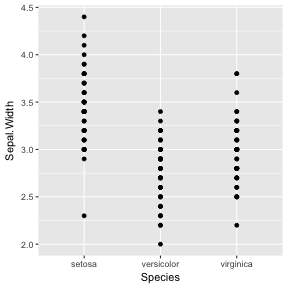
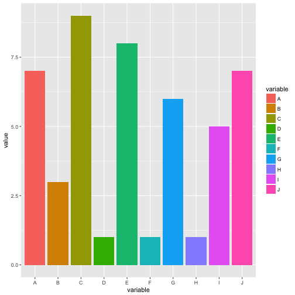
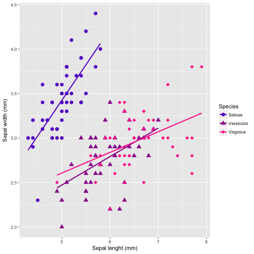
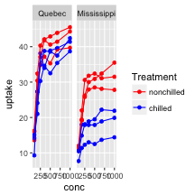
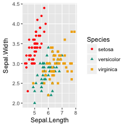
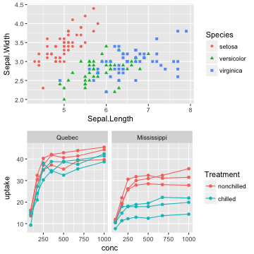
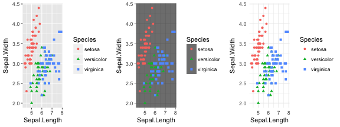
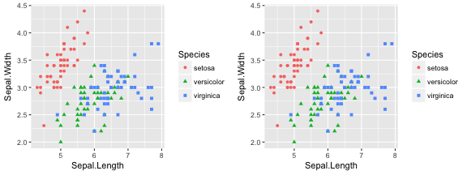

<style>
.small-code pre code {
  font-size: 0.75em;
}
</style>

ggplot2
========================================================
author: Etienne Low-Décarie
transition: rotate

January 5, 2017  
Presentation:  
Code:  


Without R
===


With R 
===


Beautiful and flexible! 
===


Outline (ggplot2)
===

1. Your first ggplot plot
    + basic scatter plot 
    + Exercise 1
2. Grammar of graphics
    + More advanced plots
    + Available plot elements and when to use them
    + Exercise 2

  
***

Tomorrow:
3. Saving a plot
  + Exercise 3
  + Challenge
4. Expanding ggplot    
5. Fine tuning your plot
    + colours
    + themes
6. Maps


A few pet peeves
===

- Always work from a script
- Use carriage returns and indentation


```r
object <- function(argument1="value1",
                   argument2="value2",
                   argument3="value3")
```

- Create your own new script
  + refer to provided code only if needed
  + don't just copy paste from the presentation


Install/load ggplot2
===


```r
if(!require(ggplot2)){install.packages("ggplot2")}
require(ggplot2)
```


Your first ggplot 
===

A basic scatter plot

```r
qplot(data=iris,
      x=Sepal.Length,
      y=Sepal.Width)
```

***


Categorical x-axis  
===

```r
qplot(data=iris,
      x=Species,
      y=Sepal.Width)
```



Less basic scatter plot
===

```r
?qplot
```

Arguments
```
x
y
…
data
xlab
ylab
main
```

Less basic scatter plot 
===


```r
qplot(data=iris,
      x=Sepal.Length,
      xlab="Sepal Width (mm)",
      y=Sepal.Width,
      ylab="Sepal Length (mm)",
      main="Sepal dimensions")
```


Exercise 1
===
produce a basic plot with built in data
```
CO2
?CO2
BOD
data()
```
WARNING: THERE ARE MULTIPLE CO2/co2 datasets
(CASE SENSITIVE)

<div class="centered">

<script src="countdown.js" type="text/javascript"></script>
<script type="application/javascript">
var myCountdown2 = new Countdown({
    							time: 300, 
									width:150, 
									height:80, 
									rangeHi:"minute"	// <- no comma on last item!
									});

</script>

</div>

Grammar of graphics (gg)
===

A graphic is made of elements (layers)

- data
- aesthetics (aes)
- transformation
- geoms (geometric objects)
- axis (coordinate system)
- scales

***


Aesthetics (aes) make data visible:
===

+ x,y : position along the x and y axis
+ colour: the colour of the point
+ group: what group a point belongs to 
+ shape: the figure used to plot a point
+ linetype: the type of line used (solid, dashed, etc)
+ size: the size of the point or line
+ alpha: the transparency of the point 

geometric objects(geoms)
===

+ point: scatterplot
+ line: line plot, where lines connect points by increasing x value
+ path: line plot, where lines connect points in sequence of appearance
+ boxplot: box-and-whisker plots, for categorical y data
+ bar: barplots
+ histogram: histograms (for 1-dimensional data)

Single element edit
===

Editing an element produces a new graph
e.g. just change the coordinate system


How it works
===

- 1. create a simple plot object

```r
plot.object<-qplot()
or
plot.object<-ggplot()
```
- 2. add graphical layers/complexity

```r
plot.object<-plot.object+layer()
```
- 3. repeat step 2 until satisfied  
- 4. print your object to screen (or to graphical device)  

```r
print(plot.object)
```


Scatter plot as an R object
===


```r
basic.plot<-qplot(data=iris,
                  x=Sepal.Length,
                  xlab="Sepal Width (mm)",
                  y=Sepal.Width,
                  ylab="Sepal Length (mm)",
                  main="Sepal dimensions")

print(basic.plot)
```


Using ggplot function
===

more powerful, more complicated
Note: aes() and geom_point()


```r
basic.plot<- ggplot(data=iris)+
               aes(x=Sepal.Length,
                  xlab="Sepal Width (mm)",
                  y=Sepal.Width,
                  ylab="Sepal Length (mm)",
                  main="Sepal dimensions")+
  geom_point()
```
now required to use stat=""


Scatter plot with colour and shape
===


```r
basic.plot <- basic.plot+
              aes(colour=Species,
                  shape=Species)

print(basic.plot)
```


Scatter plot with linear regression
===

Add a geom (eg. linear smooth)


```r
linear.smooth.plot <- basic.plot+
			  geom_smooth(method="lm", se=F)
                         print(linear.smooth.plot)
```


Exercise 2
===

produce a colorful plot containing linear regressions with built in data

```
CO2
?CO2
msleep
?msleep
OrchardSprays
data()
```
<div class="centered">

<script src="countdown.js" type="text/javascript"></script>
<script type="application/javascript">
var myCountdown3 = new Countdown({
    							time: 300, 
									width:150, 
									height:80, 
									rangeHi:"minute"	// <- no comma on last item!
									});

</script>

</div>


Using facets and groups: the basic plot
===


```r
CO2.plot<-qplot(data=CO2,
                x=conc,
                y=uptake,
                colour=Treatment)

print(CO2.plot)
```


Facets
===


```r
plot.object<-plot.object + facet_grid(rows~columns)
```
                         
                         

```r
CO2.plot<-CO2.plot+facet_grid(.~Type)
print(CO2.plot)
```



Groups
===

Problems when adding the geom_line


```r
print(CO2.plot+geom_line())
```


Groups
===

Solution: specify groups


```r
CO2.plot<-CO2.plot+geom_line(aes(group=Plant))
print(CO2.plot)
```


Available elements
===

http://docs.ggplot2.org

<iframe src="http://docs.ggplot2.org" width="1000" height="800">
  <p>Your browser does not support iframes.</p>
</iframe>

Resources
===

cheatsheets: https://www.rstudio.com/resources/cheatsheets/

<iframe src="https://www.rstudio.com/resources/cheatsheets/" width="1000"  height="800">
  <p>Your browser does not support iframes.</p>
</iframe>


Exercise 3
===

Explore geoms and other plot elements with the data you have used
and/or your own data

```
msleep
?msleep
OrchardSprays
data()
```
<div class="centered">

<script src="countdown.js" type="text/javascript"></script>
<script type="application/javascript">
var myCountdown3 = new Countdown({
    							time: 300, 
									width:150, 
									height:80, 
									rangeHi:"minute"	// <- no comma on last item!
									});

</script>

</div>


Tomorrow
===

3. Saving a plot
  + Exercise 3
  + Challenge
4. Expanding ggplot    
5. Fine tuning your plot
    + colours
    + themes
6. Maps (time permitting)


Saving plots
===


```r
pdf("./Plots/todays_plots.pdf")
  print(basic.plot)
  print(plot.with.linear.smooth)
  print(categorical.plot)
  print(CO2.plot)
graphics.off()
```

all other base save functions available:  
`bmp()`, `jpeg()`, etc

Saving plots
===

ggsave: saves last plot and guesses format from file name


```r
ggsave("./Plots/todays_plots.jpeg", basic.plot)
```


Using the right tool for the right situation
===
base R `plot` function has methods for many different object types


```r
plot(iris)
```


Using the right tool for the right situation
===

base R `plot` function has methods for many different object types


```r
lm.SR <- lm(sr ~ pop15 + pop75 + dpi + ddpi,
            data = LifeCycleSavings)
plot(lm.SR)
```


Challenge
===

Find an interesting data set on Dryad.org, reproduce a figure from the article using ggplot2

Example: try to reproduce figure 1 and 4 from
Low-Décarie, E., Fussmann, G. F., Bell, G., Low-Decarie, E., Fussmann, G. F., Bell, G., Low-Décarie, E., Fussmann, G. F. & Bell, G. 2014 Aquatic primary production in a high-CO2 world. Trends Ecol. Evol. 29, 1–10.    
[paper](http://www.sciencedirect.com/science/article/pii/S0169534714000433)  
[data](http://datadryad.org/handle/10255/dryad.60481)  
full scripts also available on github (old ugly code!)


Extending ggplot
===

ggplot can be extended for plotting specific classes of objects

`autoplot`
and
`fortify`


Extending ggplot
===

`ggfortify` provides `autoplot`and  
`fortify` for common models


```r
require(ggfortify)
autoplot(lm.SR)
```

***



===


```r
help(package=ggfortify)
```


Fine tunning: Scales
===
class: small-code


```r
CO2.plot +
  scale_y_continuous(name = "CO2 uptake rate",
                     breaks = seq(5,50, by= 10),
                     labels = seq(5,50, by= 10), 
                     trans="log10")
```


Fine tunning: Scales
===


```r
CO2.plot+
  scale_colour_brewer()
```


Fine tunning: Scales
===


```r
CO2.plot+
  scale_colour_manual(values=c("nonchilled"="red",
                               "chilled"="blue"))
```




Fine tunning: Scales
===
Bonus!!! Wes Anderson colour palette


Fine tunning: Scales
===
Bonus!!! Wes Anderson colour palette


```r
if(!require(devtools)) {install.packages("devtools")}
require(devtools)
if(!require(wesanderson)){
devtools::install_github("karthik/wesanderson")}
require(wesanderson)
```

Fine tunning: Scales
===
Bonus!!! Wes Anderson colour palette


```r
require(wesanderson)
basic.plot + 
  scale_color_manual(values = wesanderson::wes_palette("Darjeeling",3)) 
```



Fine tuning: Multiple plots
===


```r
if(!require(gridExtra)) {install.packages("gridExtra")}
require(gridExtra)

grid.arrange(basic.plot, CO2.plot)
```


Fine tuning: Multiple plots
===
class: small-code

Sub-plots can be aligned and matched in size


```r
basic.plot.table <- ggplot_gtable(ggplot_build(basic.plot))
CO2.plot.table <- ggplot_gtable(ggplot_build(CO2.plot))
maxWidth = grid::unit.pmax(basic.plot.table$widths[2:3],
                           CO2.plot.table$widths[2:3])
basic.plot.table$widths[2:3] <- as.list(maxWidth)
CO2.plot.table$widths[2:3] <- as.list(maxWidth)
```

Fine tuning: Multiple plots
===
Sub-plots can be aligned and matched in size


```r
grid.arrange(basic.plot.table, 
             CO2.plot.table,
             ncol=1)
```



Fine tuning: Themes
===

`theme_set(theme())`  
or  
`plot+theme()`


```r
dark <- basic.plot+theme_dark()
minimal <- basic.plot+theme_minimal()

grid.arrange(basic.plot, dark, minimal, nrow=1)
```




Fine tuning: Themes
===
class: small-code


```r
mytheme <- theme_grey() +
 theme(plot.title = element_text(colour = "red"))
mytheme_plot <- basic.plot + mytheme

grid.arrange(basic.plot, mytheme_plot, nrow=1)
```




Bonus: xkcd
===

<iframe src="http://xkcd.com" width="1000" height="800">
  <p>Your browser does not support iframes.</p>
</iframe>


Bonus: xkcd
===

```r
#install.packages("xkcd")
#install xkcd font: "http://simonsoftware.se/other/xkcd.ttf"
#import font : font_import(pattern = "[X/x]kcd", prompt=FALSE)
#loadfonts()
require(xkcd)
require(extrafont)

xrange <- range(iris$Sepal.Length)
yrange <- range(iris$Sepal.Width)

print(basic.plot+
  xkcdaxis(xrange,yrange)+
    theme(text=element_text(family = "xkcd")))
```

Bonus: xkcd
===


Challenge
===

Using figure from previous challenge (or other dryad.org paper/data), edit figure to match a journal's style requirements

Example: try to reproduce Figure 3 in:
Lucek K, Sivasundar A, Roy D, Seehausen O (2013) Repeated and predictable patterns of ecotypic differentiation during a biological invasion: lake-stream divergence in parapatric Swiss stickleback. Journal of Evolutionary Biology 26(12): 2691–2709. 

[paper](http://dx.doi.org/10.1111/jeb.12267)  
[data](http://dx.doi.org/10.5061/dryad.0nh60)  
