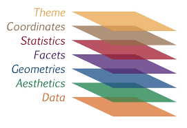
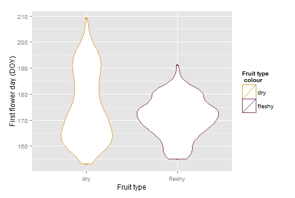
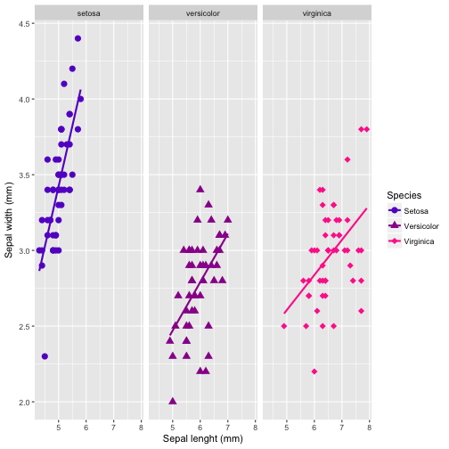
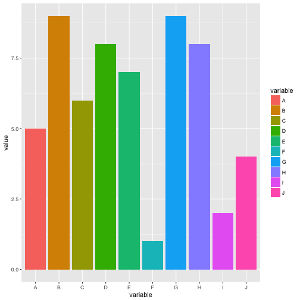
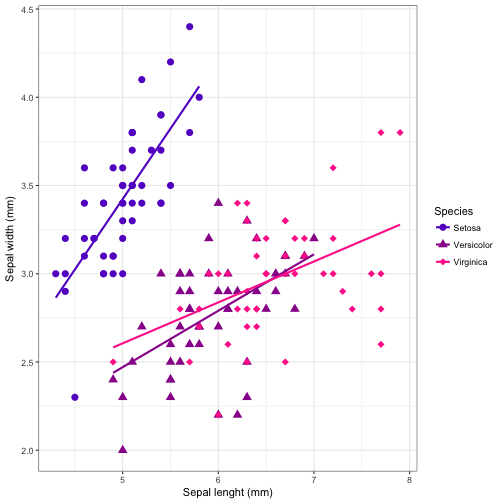

ggplot2
========================================================
author: Malie Lessard-Therrien and Étienne Low-Décarie 
date: May 8, 2017
width: 1920
height: 1080


What is a graph?
========================================================

- Explore and explain
- Statistics and design combined
- Communicating results


ggplot2
===

Beautiful and flexible


Outline (ggplot2)
===

Part I

Your first ggplot plot
- Basic scatter plot 
- Exercise 1

Grammar of graphics
- Layer system
- Aesthetics, Geometrics
- Exercise 2

***    

Part II

Pretty graphs for presentation
- More advanced plots
- Fine tunning
- Exercise 3
    

Part III

Adapting your graph for publishing
- B&W
- package cowplot
- Saving a plot
- Exercise 4
- Maps


Install/load ggplot2
===


```r
if(!require(ggplot2)){install.packages("ggplot2")}
require(ggplot2)
```


Grammar of graphics (gg)
===

2 principles:
- distinc layers of graphical elements
- meaningful plots using aesthetic mapping

***


Graph elements
===

3 essentials:
- Data (what you collected, in the right format)
- Aesthetics (aes)
- Geometries (geom)


4 optionals:
- Facets
- Coordinates
- Themes
- Statistics


***





Available elements:

http://docs.ggplot2.org


Iris dataset
===

- Edgar Anderson
- RA Fischer


```r
head (iris)
```

```
  Sepal.Length Sepal.Width Petal.Length Petal.Width Species
1          5.1         3.5          1.4         0.2  setosa
2          4.9         3.0          1.4         0.2  setosa
3          4.7         3.2          1.3         0.2  setosa
4          4.6         3.1          1.5         0.2  setosa
5          5.0         3.6          1.4         0.2  setosa
6          5.4         3.9          1.7         0.4  setosa
```


What to use when
===

Explore your data using function "qplot"
- For you and your colleagues
- Quick
- Default settings can't be changed


Explain a pattern (or lack of) in your data using function "ggplot"
- For presentation or publication
- All settings must be specified
- Flexible (you have the control over all settings)


Your first graph with ggplot2 
===

A basic scatter plot

```r
basic_graph <- qplot(data=iris,
                    x=Sepal.Length,
                    y=Sepal.Width)

print (basic_graph)
```


Change axis names 
===


```r
basic_graph_axis <- qplot(data=iris,
      x=Sepal.Length,
      y=Sepal.Width,
      xlab="Sepal length (mm)",
      ylab="Sepal width (mm)")

print (basic_graph_axis)
```


Exercice 1
===
produce a basic plot with built in data

```
data()
CO2
?CO2

```
WARNING: THERE ARE MULTIPLE CO2/co2 datasets
(CASE SENSITIVE, use capitals)

Aesthetics
===

set with the aes() function
- color ("outside" color)
- fill ("inside" color)
- shape (of points)
- linetype
- size (of points or line)
- position (i.e., on the x and y axes)
- group (that a point belongs to)
- alpha (transparency of the point)


Scatter plot with colour and shape
===


```r
basic_graph_axis_cs <- qplot(data=iris,
      x=Sepal.Length,
      y=Sepal.Width,
      xlab="Sepal length (mm)",
      ylab="Sepal width (mm)")+
  aes(colour=Species,
      shape=Species)

print (basic_graph_axis_cs)
```

Same thing as:

```r
basic_graph_axis_cs <- basic_graph_axis +
  aes(colour=Species,
      shape=Species)

print (basic_graph_axis_cs)
```

***


Geometic Objects 
===

set with the "geom_..." command

Ex:
- points (geom_point, for scatter plots, dot plots, etc)
- lines (geom_line, for time series, trend lines, etc)
- boxplot (geom_boxplot, for, well, boxplots!)
- violins (geom_violin, region inside the violin contains all of the observed data)

A plot must have at least one geom; there is no upper limit. You can add a geom to a plot using the + operator


Geometric example  
===

Categorical x-axis


```r
basic_plot_category <- qplot(data=iris,
                              x=Species,
                              y=Sepal.Width)
  
print (basic_plot_category)
```
.  
.  
.  

```r
basic_plot_category_bx <- basic_plot_category+
                          geom_boxplot ()

print (basic_plot_category_bx)
```
***


Geometric example  
===

Categorical x-axis, geom_violin




Aesthetic and geometric example
===
Give new color and shape to each iris species

Note: here aes() and geom_...() with ggplot function


```r
iris_color_graph <- ggplot (data=iris, aes (x= Sepal.Length, y=Sepal.Width, color=Species, shape=Species))+
  xlab("Sepal lenght (mm)")+
  ylab("Sepal width (mm)")+
  geom_point(size = 3)+
  geom_smooth(method="lm", se=F)+
  scale_color_manual(breaks=c("setosa", "versicolor", "virginica"), 
                     values=c("#6600CC", "#990099", "#FF3399"), 
                     labels=c("Setosa", "Versicolor", "Virginica"))+
  scale_shape_manual(breaks=c("setosa", "versicolor", "virginica"), 
                     values=c(16, 17, 18), 
                     labels=c("Setosa", "Versicolor", "Virginica"))

print (iris_color_graph)
```


Help
===

- R-help
- R Cookbook (ex color choices: http://www.cookbook-r.com/Graphs/Colors_(ggplot2)/)
- Cheatsheets (see https://www.rstudio.com/wp-content/uploads/2015/03/ggplot2-cheatsheet.pdf)
- Stackoverflow (google your question with ggplot2)


Available elements
===

http://ggplot2.tidyverse.org/reference/

<iframe src="http://ggplot2.tidyverse.org/reference/" width="1000" height="800">
  <p>Your browser does not support iframes.</p>
</iframe>


Exercise 2
===

Fine tune your graph using built in data
- play with aesthetics (aes)
- use geometrics (geom_...)


```
CO2
?CO2
data()
```
WARNING: THERE ARE MULTIPLE CO2/co2 datasets
(CASE SENSITIVE, use capitals)

<div class="centered">

<script src="countdown.js" type="text/javascript"></script>
<script type="application/javascript">
var myCountdown2 = new Countdown({
    							time: 300, 
									width:150, 
									height:80, 
									rangeHi:"minute"	// <- no comma on last item!
									});

</script>

</div>


Theme
===

Changing font size


```r
iris_color_graph_fs <- iris_color_graph+
  theme(axis.title.x=element_text(size=30),
        axis.text.x=element_text(size=25))+
  theme(axis.title.y=element_text(size=30),
        axis.text.y=element_text(size=25))

print (iris_color_graph_fs)
```
***


Facets
===

Divide the data graphically

facet_grid(rows~columns)


```r
iris_facets <- iris_color_graph + 
              facet_grid(. ~ Species)

print (iris_facets)
```
***



Coordinates
===

Change the coordinate system


```r
DF <- data.frame(variable = LETTERS[1:10], value = sample(10, replace = TRUE))

bar_graph <- ggplot(data=DF, 
                aes(x=variable,
                    y=value,
                    fill=variable))+
                geom_bar(stat="identity")

print(bar_graph)
```


```r
polar_graph <- ggplot(data=DF, 
                aes(x=variable,
                fill=variable,
                y=value))+
                geom_bar(stat="identity") + 
                coord_polar()

print(polar_graph)
```
***



Exercise 3
===

Explore graph elements with the data you have used
and/or your own data
- theme
- facets
- coordinates


Graph for publication
===

B&W background using theme_bw ()

```r
iris_bw <- iris_color_graph+
  theme_bw()
  
print(iris_bw)
```
***


Graph for publication
===

B&W using theme_classic ()

```r
iris_classic <- iris_color_graph+
           theme_classic()

print (iris_classic)
```
***


Graph for publication with cowplot
===

- simple add-on to ggplot2
- provide a publication-ready theme for ggplot2
- minimum amount of fiddling with sizes of axis labels, plot backgrounds, etc

see https://cran.r-project.org/web/packages/cowplot/vignettes/introduction.html


```r
if(!require(cowplot)){install.packages("cowplot")}
require(cowplot)
```


Cowplot, B&W graph 
===

Once cowplot package is installed and read, your graph background is B&W by default


```r
iris_cowplot <- iris_color_graph

print (iris_cowplot)
```
***


Cowplot, multiple graphs
===

Label and align multiple graphs


```r
fig.1 <- plot_grid(iris_bw, iris_cowplot, labels = c("a)", "b)"), nrow = 2, align = "v")
print (fig.1)
```
***


Saving plots
===


```r
pdf("./Plots/todays_plots.pdf")
  print(basic_graph_cs)
  print(iris_color_graph_fs)
  print(polar_graph)
  print(bar_graph)
  print (iris_cowplot)
graphics.off()
```

all other R-base save functions available:  
`bmp()`, `jpeg()`, etc

Saving plots
===

ggsave: saves last plot and guesses format from file name


```r
ggsave("./Plots/todays_plots.jpeg", iris_facets)
```

Exercise 4
===

Make a graph in B&W background and save your favorite graphs of the day

